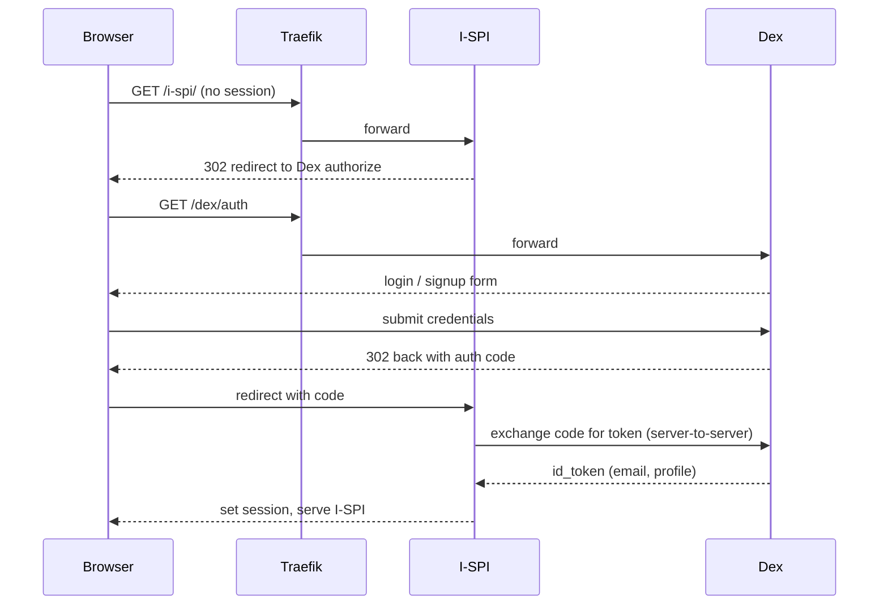
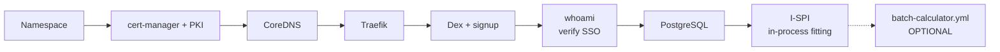

# Standalone I-SPI — Architecture & Planning Guide

This is the conceptual companion to [`README-STANDALONE-ISPI.md`](README-STANDALONE-ISPI.md).
The README is the runbook (which commands, in what order); this guide explains *what you are
building, the choices behind it, and how the pieces fit together*.

It describes a focused analysis instance: **I-SPI with its supporting edge, auth, and data
layers**. I-SPI performs its standard-curve fitting and concentration calculations *in-process*
(see §1 and §3.4), so a complete, working instance does **not** require any separate compute
service. The repo's external **Batch Calculator** is included as an *optional* add-on for sites
that want to offload fitting, but the provided I-SPI build does not invoke it (§3.5). Data
Portal, the data-ingest API/Worker, the main Redis, and MinIO are out of scope — they belong to
the data-sharing portal, not to a focused analysis instance.

> **A note on names.** The product is *ImmunoPlex*, and everything here now uses that name
> consistently — the `immunoplex` Kubernetes namespace, the `immunoplex` database, the
> `IMMUNOPLEX_*` configuration placeholders, and the `ghcr.io/immunoplex/*` images. You may still
> encounter the project's former name, *immunoodle*, in older clones, image tags, or upstream
> history; they refer to the same project.

---

## 1. What you are deploying

I-SPI (the interactive R Shiny application for Luminex bead-based immunoassay data) is the
visible application. Standing it up means deploying three supporting layers around it — an
**edge / ingress** layer that terminates TLS and routes traffic, an **authentication** layer
that gives every user a single sign-on identity, and a **data** layer.

> **Where the heavy fitting runs — read this first.** The I-SPI source (`global.R`,
> `batch_fit_functions.R`, `bayes_concentration_functions.R`) performs all standard-curve
> fitting and the concentration / se_concentration / pcov computation **inside the I-SPI pod**:
> frequentist robust curves, JAGS MCMC, and the Bayesian ensemble via the `stanassay` package,
> all parallelized with the R `future` package across the pod's CPU cores. It coordinates job
> state through the shared `immunoplex` database (`madi_results` schema). It does **not** call
> the external `batch-calculator-api` service and reads no endpoint or key for it.
>
> So "batch fitting" here means in-process batch processing, and **I-SPI itself is the
> CPU/memory-heavy component** — size it accordingly (§2.5). The standalone
> `batch-calculator.yml` service is an *optional, separate* deployment that this I-SPI build
> does not invoke; see §3.5 before deciding whether to deploy it.

Everything runs in one Kubernetes namespace (`immunoplex`) as ordinary `Deployment` +
`Service` pairs, with `PersistentVolumeClaim`s for the few things that must survive a restart.
No operator, no Helm, no service mesh — plain YAML applied with `kubectl`.

```mermaid
flowchart TB
    User([Researcher in a browser])

    subgraph edge["Edge / Ingress"]
        TR["Traefik<br/>LoadBalancer :80 / :443<br/>TLS termination + routing"]
    end

    subgraph auth["Authentication (SSO)"]
        DEX["Dex<br/>OIDC provider :5556 / gRPC :5557"]
        SIGNUP["dex-account (signup UI) :8080"]
        WHO["whoami (optional test harness)"]
    end

    subgraph app["Application"]
        ISPI["I-SPI Shiny app :3838<br/>in-process fitting:<br/>stanassay/Stan + JAGS via future"]
    end

    subgraph data["Data"]
        PG[("PostgreSQL :5432<br/>TLS, hardened<br/>db: immunoplex / madi_results")]
    end

    subgraph batch["batch-calculator.yml (OPTIONAL — not invoked by this I-SPI build)"]
        BCAPI["batch-calculator-api :8000"]
        BRD[("batch-calculator-redis :6379")]
        BCWK["batch-calculator-worker"]
    end

    User --> TR
    TR --> DEX
    TR --> SIGNUP
    TR --> WHO
    TR --> ISPI

    ISPI --> DEX
    WHO --> DEX
    ISPI -- "fit + read/write results (madi_results)" --> PG

    BCWK -. "same DB, if deployed" .-> PG
    BCAPI -. BRD
    BCWK -. BRD
```

| Component | Image | Port(s) | Persists data? | Depends on | Role |
|---|---|---|---|---|---|
| **Traefik** | `traefik:v3.5.4` | 80, 443 | No | — | Entry point, TLS, routing |
| **Dex** | `dexidp/dex:v2.44.0-alpine` | 5556, 5557 | Yes (1G PVC, SQLite) | Traefik, cert-manager | OIDC identity provider |
| **dex-account** | `ghcr.io/immunoplex/signup:main` | 8080 | No | Dex (gRPC) | Self-service signup |
| **whoami** *(optional)* | `traefik/whoami`, `oauth2-proxy:v7.8.1` | 80, 8080 | No | Dex | Auth-chain verification |
| **PostgreSQL** | `postgres:17.2` | 5432 | Yes (20G PVC) | — | System of record (`immunoplex` db) |
| **I-SPI** | `ghcr.io/immunoplex/i-spi:main` | 3838 | No (uses PG) | PostgreSQL, Dex | The analysis app **+ in-process fitting** |
| *batch-calculator-api* (optional) | `ghcr.io/immunoplex/immunoplex-batch-cal-api:main` | 8000 | No | batch redis | External fitting API (not called here) |
| *batch-calculator-redis* (optional) | `redis:7` | 6379 | No | — | Dedicated job queue |
| *batch-calculator-worker* (optional) | `ghcr.io/immunoplex/immunoplex-batch-cal-worker:main` | — | No (writes PG) | batch redis, PostgreSQL | External fitting worker |

---

## 2. The broad choices to make before you start

### 2.1 Where will it run — your own cluster, or fresh K3s?

The manifests are vanilla Kubernetes and run on any conformant cluster with a default
`StorageClass` that satisfies `ReadWriteOnce` claims and a way to expose a `LoadBalancer`
service. If you have none, `K3S.md` installs single-node K3s. Note K3s is installed with
`--disable=traefik`: this project ships its **own** namespace-scoped Traefik, so the bundled
one is turned off to avoid a conflict.

### 2.2 Connected or air-gapped?

Workloads pull images from public registries by default. For an offline install, follow
`OFFLINE-IMAGES.md`'s save/transfer/load pattern, building the image list from the `image:` fields of
the manifests you actually apply (for this configuration: Traefik, Dex, signup, PostgreSQL,
I-SPI, `redis:7`, and the two `immunoplex-batch-cal-*` images, plus oauth2-proxy/whoami if you
keep the test harness). One air-gap trap: the Dex pod's init container downloads its web theme
(`web.zip`) from GitHub on first start; pre-seed the `dex` PVC with the unpacked `web/`
directory at `/var/dex/web` so that download is skipped.

### 2.3 TLS strategy — self-signed CA or your own certificates?

The default path builds a private PKI with cert-manager: a self-signed `root-ca`, an
`intermediate-ca1` it signs, and a `ClusterIssuer` (`intermediate-ca1-issuer`) that every
Ingress references. Certificates are minted automatically into `cert-secret`. The trade-off is
that browsers won't trust this CA until you import the exported root certificate. For a closed
research environment that is fine; for browser-trusted certs without manual import, swap in an
ACME/real-CA `ClusterIssuer` and keep the same annotation pattern on the Ingresses.

### 2.4 Hostname and DNS

A single hostname (`IMMUNOPLEX_HOSTNAME`) is used everywhere — the OIDC issuer, the Ingress
host, and every OAuth redirect URI — and it is baked in at `sed` time. **Choose the name users
will actually type in their browsers.** Mismatches here are the most common failure
(OAuth "redirect URI mismatch"). Pods also need to resolve that hostname internally, which is
why `coredns.yml` maps `IMMUNOPLEX_HOSTNAME → IMMUNOPLEX_IP_ADDRESS` for in-cluster lookups; on
an isolated K3s node you almost certainly need it.

### 2.5 Sizing — I-SPI is the heavy component

Because the provided I-SPI build runs all fitting **in-process** (stanassay/Stan + JAGS,
parallelized with `future` on a multicore plan), the expensive computation happens inside the
I-SPI pod, not in a separate worker. That makes I-SPI the CPU- and memory-bound component, and
it is why the original manifest's commented-out `resources` requested 6 CPU and limited to 10.

Practically: give **I-SPI** generous CPU and memory. The corrected manifest starts at requests
2 CPU / 4Gi and limits 8 CPU / 12Gi — schedulable on a modest node, but raise both (and use a
node larger than the documented 4-core / 16 GB floor) for real fitting workloads, since
`future` will use as many cores as you give it and Stan/JAGS runs are memory-hungry (the app
configures `future` for several GB of globals). The 4-core / 16 GB floor is adequate for light
use and bring-up; production fitting wants more.

If you later move fitting off the I-SPI pod by deploying the external Batch Calculator (§3.5)
*and* running an I-SPI build that submits to it, the sizing balance shifts to the worker — but
that is not how the provided code behaves.

---

## 3. How the components fit together

### 3.1 Edge: Traefik

Traefik is the only component exposed outside the cluster, as a `LoadBalancer` on 80/443. It
terminates TLS and routes by URL path. It is intentionally namespace-scoped
(`--providers.kubernetesingress.namespaces=immunoplex` plus a namespaced `Role`), so it only
watches `immunoplex`. A `ConfigMap` of middlewares does the path surgery: `i-spi-stripprefix`
removes the `/i-spi` prefix so the app sees its own root, `addslashbyredirect` adds the
trailing slash Shiny needs, `dex-account-stripprefix` serves the signup UI, and
`forcehttpsredirect` pushes HTTP to HTTPS. (The standalone `traefik.yml` drops the Data Portal
middleware, which is unused here.)

### 3.2 Authentication: Dex (+ signup, + optional whoami)

Authentication is OpenID Connect single sign-on with **Dex** as the provider at
`https://HOST/dex`. Dex stores users in a local SQLite database on its PVC
(`enablePasswordDB: true`), so no external identity provider is required. It defines one static
OAuth client (`ImmunoPlex`) whose ID and secret are the `IMMUNOPLEX_OAUTH_CLIENT_ID` /
`IMMUNOPLEX_OAUTH_SECRET` values; the standalone `dex.yml` trims its redirect URIs to just the
I-SPI URLs (and the whoami callback). **dex-account** is the self-service signup UI at
`/dex/account`, talking to Dex over gRPC. **whoami** is an optional harness for proving the
auth chain works before deploying I-SPI — deploy it during bring-up, then delete it.

I-SPI speaks OIDC natively (it holds the client secret), so it needs no proxy in front of it.



A subtlety: the redirect to Dex must use the **public** URL (`https://HOST/dex`) because the
browser follows it, while the server-to-server token exchange uses the **internal** service URL
(`http://dex:5556/dex`). I-SPI receives both as `DEX_ISSUER` and `DEX_INTERNAL_URL`.

### 3.3 Data: PostgreSQL

A single PostgreSQL instance is the system of record, holding the `immunoplex` database (loaded
from `i-spi-db.sql`). The deployment is deliberately hardened by an init script: it rewrites
`pg_hba.conf` to **reject all non-TLS connections** and require `md5` over TLS, generates a
self-signed server certificate, and revokes default `PUBLIC` privileges. Because non-TLS is
rejected, every client must connect over SSL — which is why I-SPI connects with `sslmode=require`
(set in `global.R`) and sets `PGSSLCERT=/tmp/postgresql.crt`. (If you also deploy the external
Batch Calculator, its worker must likewise use `DB_SSLMODE=require` — the corrected value; the
original `disable` would be refused.) I-SPI uses the `madi_results` schema in this database both
for its own tables and for the curve fits and concentration results it computes.

### 3.4 The application: I-SPI — and where fitting happens

I-SPI is the R Shiny app on port 3838 — the reason the rest exists. It connects to the
`immunoplex` database over TLS and authenticates users through Dex. Crucially, it also **does
the numerical heavy lifting itself**: `global.R` loads the `stanassay` package into the app and
sets a `future` multicore plan, and the fitting code (`batch_fit_functions.R`,
`bayes_concentration_functions.R`) runs frequentist robust curves, JAGS MCMC, and the Bayesian
ensemble in background R processes *within the pod*, writing results to the `madi_results`
schema. "Batch" in this app means batch-processing many curves locally, parallelized across the
pod's cores — not handing work to an external service. I-SPI holds no durable state of its own;
everything persists in PostgreSQL.

The practical consequence is the sizing point from §2.5: I-SPI is the CPU/memory-hungry
component, so give it room.

### 3.5 The external Batch Calculator (optional, not invoked by this build)

The repo also ships a standalone Batch Calculator — a FastAPI service
(`batch-calculator-api`), a dedicated Redis (`batch-calculator-redis`, `redis:7`), and an R
worker (`batch-calculator-worker`) that uses the same
[`stanassay`](https://github.com/immunoplex/stanassay) package to produce curve fits and the
**concentration**, **se_concentration**, and **pcov** outputs. It is a way to run those Stan
workloads *out of process*, on a separately sizable worker, writing results to the same
`immunoplex` / `madi_results` database. Its only external dependency is PostgreSQL; it brings
its own Redis, so it pulls in no other excluded component.

**However, the provided I-SPI source does not call it.** There is no HTTP client to
`batch-calculator-api` anywhere in the code, and no environment variable for its endpoint or API
key — the only env vars I-SPI reads are the database credentials and `LOCAL_DEV`. The fitting
happens in-process as described in §3.4. The external service therefore represents an
*alternative* topology (offloading fitting from the pod) that would require an I-SPI build wired
to submit jobs to it — which this one is not.

What this means for you:

- **If you run this I-SPI build, you do not need `batch-calculator.yml`.** Fitting works
  in-process; deploying the external service would leave it idle (nothing submits jobs to it).
- **Deploy `batch-calculator.yml` only** if your I-SPI build is known to hand fitting jobs to
  it (via the `madi_results` job tables the schema exposes, or a newer code path), or you are
  staging for that. The corrected manifest (`DB_SSLMODE=require`) is ready if so.

There is consequently no I-SPI → Batch "submission" wiring to configure in `i-spi.yml`; the
earlier drafts' commented endpoint/key have been removed.

---

## 4. Configuration and secrets model

There is no secret manager — configuration is text substitution at install time via the `sed`
step. For this configuration, these placeholders matter:

| Placeholder | How it's set | Used by |
|---|---|---|
| `IMMUNOPLEX_HOSTNAME` | You choose it | Ingresses, OIDC issuer, all redirect URIs |
| `IMMUNOPLEX_IP_ADDRESS` | The host's IP | CoreDNS internal resolution |
| `IMMUNOPLEX_POSTGRES_PASSWORD` | A strong password | PostgreSQL, I-SPI (+ batch worker if deployed) |
| `IMMUNOPLEX_OAUTH_CLIENT_ID` | `openssl rand -hex 32` | Dex client + I-SPI |
| `IMMUNOPLEX_OAUTH_SECRET` | `openssl rand -hex 32` | Dex client + I-SPI |
| `IMMUNOPLEX_REDIS_AUTH` | A strong password | *Optional* `batch-calculator.yml` Redis only |
| `IMMUNOPLEX_API_KEY` | `openssl rand -hex 32` | *Optional* `batch-calculator.yml` API only |
| `IMMUNOPLEX_OAUTH_COOKIE_SECRET` | `openssl rand -hex 16` | whoami only (if deployed) |

For a core I-SPI install you need only the first five (hostname, IP, Postgres password, and the
two OAuth values). `IMMUNOPLEX_REDIS_AUTH` and `IMMUNOPLEX_API_KEY` matter only if you deploy
the optional Batch Calculator; `IMMUNOPLEX_OAUTH_COOKIE_SECRET` only if you deploy whoami.

One consequence worth internalizing: **shared values must match across files** — the OAuth
client secret is identical in `dex.yml` and the `i-spi` Secret, filled by a single `sed` pass so
no manifest reaches into another's Secret. Secrets end up in plain `stringData`; keep the
substituted copies out of version control.

---

## 5. Corrections applied (vs. the original repo manifests)

This configuration depends on these fixes, all documented inline in the manifests. Several were
confirmed against the I-SPI app's own `.env.sample` (the `madi-lumi-reader` container), which is
the authoritative list of variables the app reads.

1. **I-SPI's Dex secret.** I-SPI originally read `DEX_CLIENT_SECRET` from a Secret named
   `data-portal`, created only by `data-portal.yml`. Without Data Portal that Secret is missing
   and I-SPI fails to start. The corrected `i-spi.yml` reads from its own `i-spi` Secret.
2. **I-SPI redirect/logout variable.** The original `REDIRECT_URL: ???` was a placeholder for a
   variable the app does not read — its `.env.sample` documents `DEX_LOGOUT_ENDPOINT` instead
   (matching the sibling Data Portal app). `REDIRECT_URL` is replaced with `DEX_LOGOUT_ENDPOINT`
   set to `https://HOST/i-spi/`. The login redirect itself is handled by `APP_REDIRECT_URI`,
   which was already correct.
3. **Python-engine database credentials.** The `.env.sample` documents a second, uppercase set
   of DB variables (`DB`, `DB_HOST`, `DB_PORT`, `DB_USERID_X`, `DB_PWD_X`) "for python engine,"
   with the same values as the lowercase R-engine set. The original manifest set only the
   lowercase set; the corrected one sets both.
4. **`upload_template_path`.** Documented in the `.env.sample` but omitted by the original
   manifest; now set (back it with a PVC if uploaded templates must persist).
5. **I-SPI resources.** The `resources` block was commented out; now set to tunable starting
   values so the pod is schedulable with sensible bounds.
6. **I-SPI logging.** `SHINY_LOG_LEVEL` is `INFO` for normal operation (was `DEBUG`).
7. **Batch worker SSL (only if you deploy the optional `batch-calculator.yml`).** `DB_SSLMODE`
   was `disable`, which the hardened PostgreSQL rejects; it is now `require`.

There is no I-SPI → Batch Calculator **submission** wiring to configure. Earlier drafts added a
commented endpoint and an `immunoplex_api_key` variable by analogy with the Data Portal app, but
the I-SPI source confirms it neither calls `batch-calculator-api` nor reads any endpoint/key —
fitting is in-process (§3.4, §3.5). Those speculative lines have been removed from `i-spi.yml`.

---

## 6. Deployment order

Apply bottom-up so each consumer's dependency is already answering when it starts.



In words: namespace and (on K3s) cert-manager + the CA + CoreDNS first; then Traefik; then Dex
and signup; verify with whoami; then PostgreSQL (create the `immunoplex` database and load
`i-spi-db.sql`); then I-SPI — at which point you have a fully working analysis instance, since
fitting runs inside the I-SPI pod. The external `batch-calculator.yml` is an optional last step
and only meaningful if your I-SPI build offloads to it (§3.5). Each application step should pair
`kubectl apply` with `kubectl wait --for=condition=ready` before moving on, because a dependent
pod that starts too early will crash-loop until its dependency is up.

---

## 7. Verifying a live instance

The end-to-end check for the auth foundation is the **whoami login**: browse to
`https://HOST/whoami`, sign up, log in, and confirm `X-Forwarded-Email` appears. Confirm
PostgreSQL with `select version();`. Then load I-SPI at `https://HOST/i-spi/`, authenticate, and
run a fit — when the results (concentration / se_concentration / pcov) appear, the in-process
fitting path is working. (If you deployed the optional Batch Calculator, also confirm its API
returns `{"status":"ok","redis":"connected"}` from `/health`, though this I-SPI build does not
drive it.)

---

## 8. Day-2 notes

- **Backups.** Durable state is the `immunoplex` PostgreSQL database (both I-SPI's tables and the
  `madi_results` schema) and Dex's SQLite user store on its PVC. Use `pg_dump` for the database;
  don't forget the Dex PVC if you want to preserve user accounts. The job queue in
  batch-calculator-redis is transient and does not need backup.
- **Upgrades.** I-SPI's image tracks `:main` with `imagePullPolicy: Always`, so a pod restart
  pulls the latest build. For reproducibility, pin to a specific tag or digest in a controlled
  environment.
- **Scaling.** Fitting runs inside the I-SPI pod, so the way to fit faster is to give I-SPI more
  CPU/memory (vertical scaling) on a larger node — `future` uses the cores available. Running
  multiple I-SPI replicas is possible for concurrent users (it's stateless, with the sticky
  considerations of a Shiny app), but does not speed up a single fit. PostgreSQL and Dex (SQLite)
  are single-instance (`strategy: Recreate`) and not built for multi-replica here. Only if you
  adopt the optional external Batch Calculator does horizontal worker scaling enter the picture.
